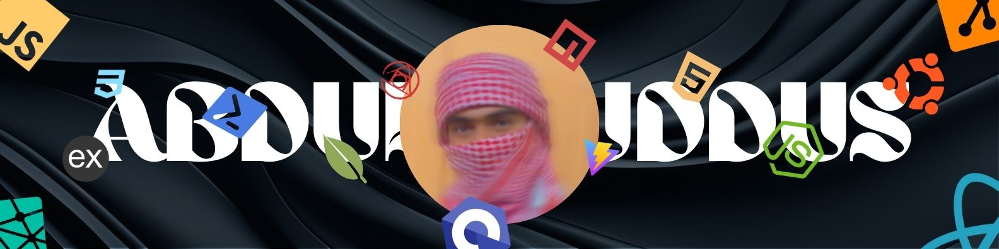
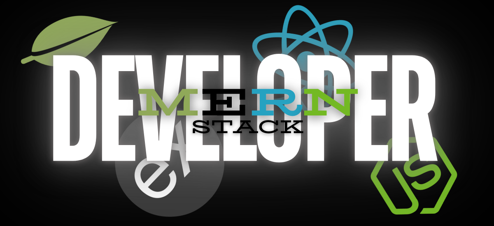

  
<h1><tt>-About💫Me-</tt></h1>
🔭 I’m currently working on NextJS 👯 I’m looking to collaborate on MERN Stack Devs 🤝 I’m looking for help with ExpressJS 🌱 I’m currently learning NextJS 💬 Ask me about MERN Stack development ⚡ Fun fact Playing Video Games.
  
 

<h2><tt>-🌐Socials-</tt></h2>

   

 

 

<h2><tt>-Teck📈Stack-</tt></h2>

<h3><tt>-Languages-</tt></h3>

         

<h3><tt>-Bash Tools CLI-</tt></h3>

    

<h3><tt>-Production-</tt></h3>

 

<h3><tt>-Frameworks & Libraries-</tt></h3>

                  

<h3><tt>-Package Managers-</tt></h3>

  

<h3><tt>-Runtime Enviroment-</tt></h3>

  

<h3><tt>-Data Bases & ORM-</tt></h3>

    

<h3><tt>-Design Tools-</tt></h3>

      

<h3><tt>-Formatter-</tt></h3>

 

<h3><tt>-VCS & Hosting-</tt></h3>

   

<h3><tt>-Testing-</tt></h3>

<h3><tt>-Utilities-</tt></h3>

  

<h3><tt>-Native Devs-</tt></h3>

  

<h3><tt>-Entertainments-</tt></h3>

     

<h3><tt>-GitHub📊Stats-</tt></h3>

 

 
 

<h2><tt>-GitHub🏆Trophies-</tt></h2>
 

<h3><tt>-Dev✍️Quote-</tt></h3>

<h3><tt>-Top🔝ContributedRepo-</tt></h3>

    
    

 

<h3><tt>-You can help me by Donating💰-</tt></h3>

  
  

